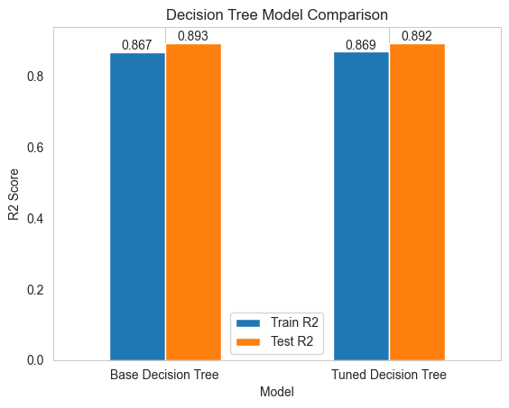
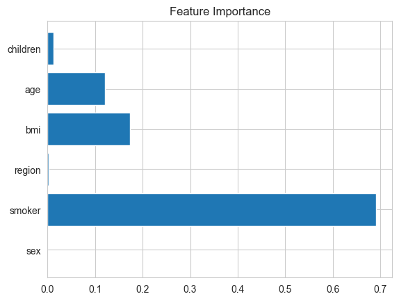
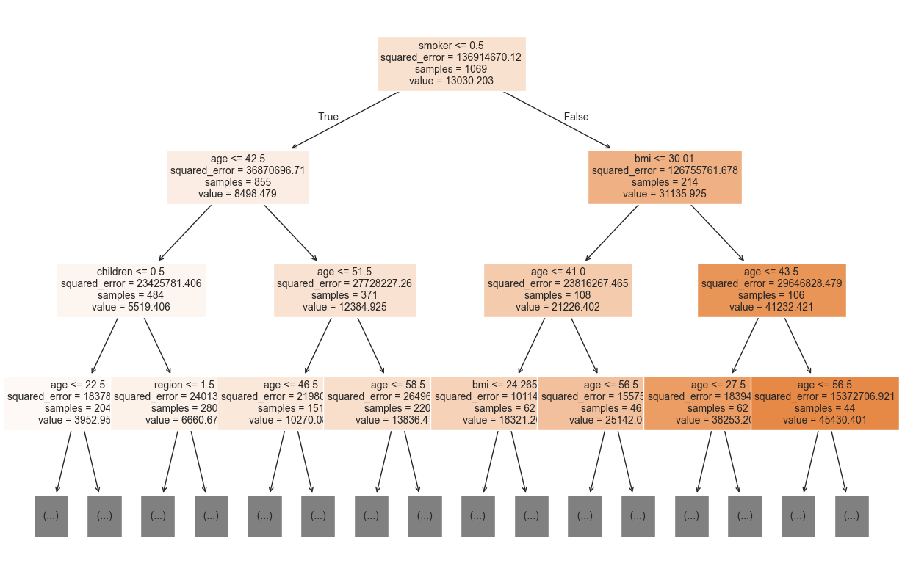
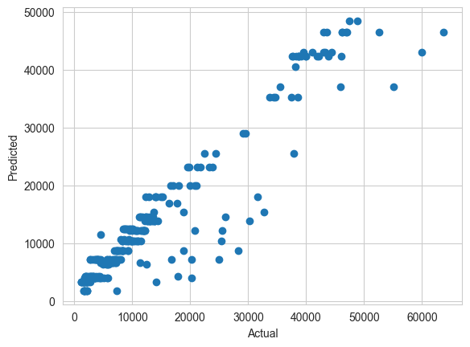

# 🧠 Decision Tree Regression – Insurance Cost Prediction

## 📌 Overview

This project builds a **Decision Tree Regression model** to predict medical insurance charges based on individual attributes such as age, BMI, smoking status, and more.

The goal is to understand model behavior, evaluate performance, and reduce overfitting using hyperparameter tuning.

---

## 📊 Dataset

* **Dataset:** Insurance Dataset
* **Features:**

  * Age
  * BMI
  * Number of Children
  * Smoker Status
  * Region

---

## ⚙️ Model Development

* Base Model: `DecisionTreeRegressor`
* Tuned Model: `GridSearchCV` for hyperparameter optimization

Key parameters tuned:

* `max_depth`
* `min_samples_split`
* `min_samples_leaf`

---

## 📈 Results

| Model               | Train R² | Test R² |
| ------------------- | -------- | ------- |
| Base Decision Tree  | 0.867    | 0.893   |
| Tuned Decision Tree | 0.868    | 0.892   |

---

## 📊 Visualizations

The project includes:

* Model comparison bar charts
* Labeled performance graphs
* Train vs Test performance line plot

---

## 🔍 Key Insights

* Decision Trees can **overfit easily** if not controlled
* The base model slightly outperformed on test data
* The tuned model shows **better generalization** (smaller gap between train and test scores)

---

## 🛠️ Tech Stack

* Python
* pandas
* numpy
* scikit-learn
* matplotlib

---

## 🚀 Future Improvements

* Try ensemble methods like **Random Forest** and **XGBoost**
* Perform feature engineering
* Deploy the model using Flask or FastAPI

---

## 📌 Conclusion

While both models performed similarly, hyperparameter tuning helped create a more **stable and generalizable model**, which is crucial for real-world applications.

---

## 📷 Output Samples

### 📊 Model Comparison

### 📈 Feature Importance

### 🌳 Decision Tree Visualization

### 📉 Scatter Plot

---